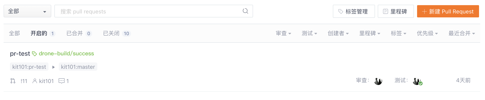
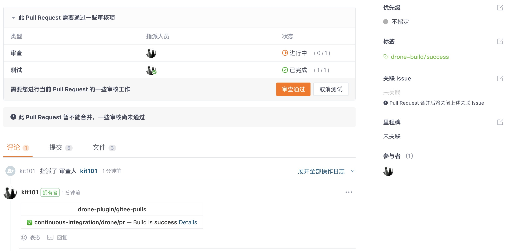

# drone-plugin-gitee-pulls

[](http://cloud.drone.io/kit101/drone-plugin-gitee-pulls)
[](https://discourse.drone.io)
[](https://godoc.org/github.com/kit101/drone-plugin-gitee-pulls)
[](https://goreportcard.com/report/github.com/kit101/drone-plugin-gitee-pulls)

[EN](./README.md)

<div style="display: none;">
Drone插件，用于在Gitee的PR中创建注释和标签。

有关使用信息和可用选项列表，请查看[文档](https://plugins.drone.io/plugins/gitee-pulls).
</div>

## Build

使用以下命令构建二进制文件:

```console
export GOOS=linux
export GOARCH=amd64
export CGO_ENABLED=0
export GO111MODULE=on

go build -v -a -tags netgo -o release/linux/amd64/drone-plugin-gitee-pulls
```

## Docker

使用以下命令构建docker镜像:

```console
docker build \
  --label org.label-schema.build-date=$(date -u +"%Y-%m-%dT%H:%M:%SZ") \
  --label org.label-schema.vcs-ref=$(git rev-parse --short HEAD) \
  --file docker/Dockerfile.linux.amd64 --tag kit101z/drone-plugin-gitee-pulls .
```

## 在docker中使用

```console
docker run --rm \
  -e PLUGIN_ACCESS_TOKEN=your-access-token \
  -e PLUGIN_IS_RUNNING=true \
  -e DRONE_SYSTEM_HOST=your.drone.host \
  -e DRONE_SYSTEM_PROTO=https \
  -e DRONE_REPO=kit101/demo1 \
  -e DRONE_PULL_REQUEST=11 \
  -e DRONE_BUILD_LINK=https://your.drone.host/api/badges/kit101/demo1/status.svg?ref\=refs/pull/11/head \
  -e DRONE_STAGE_STATUS=success \
  -e DRONE_COMMIT_REF=refs/pull/11/head \
  kit101z/drone-plugin-gitee-pulls
```

## 在drone中使用

### 参数参考

**debug**:
启用debug模式, 默认: `false`.

**api_server**:
gitee api服务url, 默认: `https://gitee.com/api/v5`.

**access_token**:
gitee access token, 可以生成一个personal access token.

**is_running**:
构建是否正在进行中, 默认: `false`.

**comment_disabled**:
禁用自动更新含构建状态的评论, 默认: `false`.

**label_disabled**:
禁用自动更新含构建状态的标签, 默认: `false`.

**running_label**:
设置正在构建标签的名称和颜色, 默认: `drone-build/running,E6A23C`.

**success_label**:
设置构建成功标签的名称和颜色, 默认: `drone-build/success,67C23A`.

**failure_label**:
设置构建失败标签的名称和颜色, 默认: `drone-build/failure,DB2828`.

**test_disabled**:
禁用自动更新测试状态, 默认: `false`

### example

```yaml
---
name: default
kind: pipeline
type: docker

#label has default values
#environment:
#  PLUGIN_GITEE_RUNNING_LABEL: drone-build/running,E6A23C
#  PLUGIN_GITEE_SUCCESS_LABEL: drone-build/success,67C23A
#  PLUGIN_GITEE_FAILURE_LABEL: drone-build/failure,DB2828

steps:
  - name: pr-enhance/start
    pull: always
    image: kit101z/drone-plugin-gitee-pulls
    settings:
      # should set `is_running: true` in the first step
      is_running: true
      access_token:
        from_secret: GITEE_ACCESS_TOKEN
    when:
      event:
        - pull_request

  - name: env
    image: alpine
    commands:
      - env

  - name: pr-enhance/end
    image: kit101z/drone-plugin-gitee-pulls
    settings:
      access_token:
        from_secret: GITEE_ACCESS_TOKEN
    when:
      event:
        - pull_request
      status:
        - failure
        - success
```

## 图示






## 常见问题

_创建Issue询问使用问题_